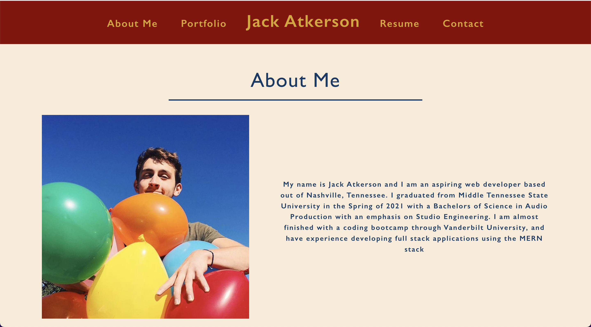

# Challenge 20: React Portfolio

## Description
A portfolio website created using React to showcase the work I have done in the Bootcamp, and to use as a professional level portfolio site moving forward in my career.

## Table of Contents
- [Demonstration](#demonstration)
- [Usage](#usage)
- [Credits](#credits)
- [Questions](#questions)

## User Story

```
AS AN employer looking for candidates with experience building single-page applications
I WANT to view a potential employee's deployed React portfolio of work samples
SO THAT I can assess whether they're a good candidate for an open position
```

## Demonstration


## Usage
Visit this link to see the site in action:
https://jackatkerson.github.io/atkerson-react-portfolio/

## Credits
Made by: Jack Atkerson

## Questions
Feel free to reach out to me at:
[E-Mail](mailto:jatkerson18@gmail.com),
[GitHub](https://github.com/JackAtkerson)